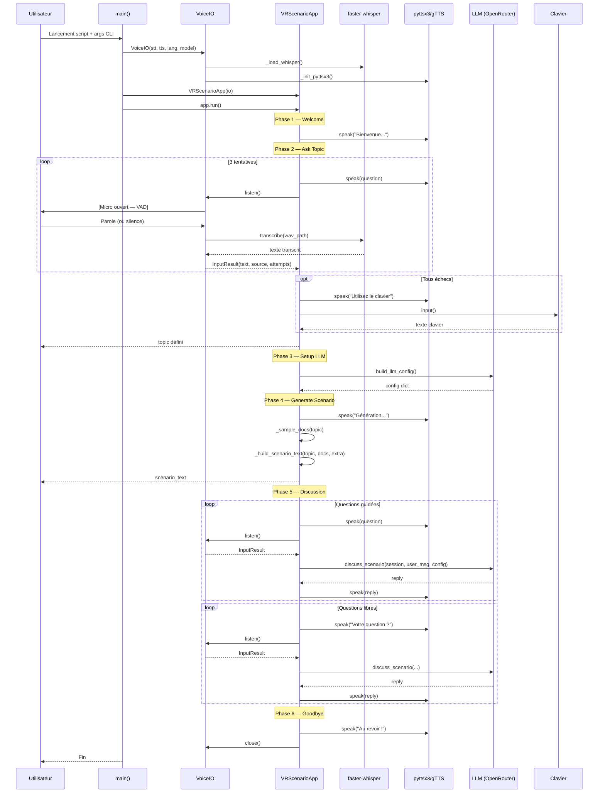

# README v2 — Analyse Technique : `scenario_conversation_app_vocal_only_fixed.py`

> **Fichier analysé** : `scenario_conversation_app_vocal_only_fixed.py`
> **Taille** : ~19 661 lignes
> **Version** : Enterprise
> **Date d'analyse** : Juin 2026

---

## 1. Résumé

**But du script** : Application vocale complète de génération et supervision de scénarios VR pour le secteur gazier. Dialogue en boucle avec l'utilisateur via STT/TTS, génère des scénarios pédagogiques et répond aux questions en temps réel.

**Entrées** : Microphone (VAD), clavier (fallback), arguments CLI (`--stt-backend`, `--tts-backend`, `--whisper-model`, `--language`, `--debug`).

**Sorties** : Synthèse vocale (pyttsx3/gTTS), texte transcrit, réponses LLM, logs structurés.

**Dépendances externes** : `faster-whisper` (STT), `pyttsx3`/`gTTS` (TTS), `SpeechRecognition` (VAD), `pygame` (audio), `openrouter`/`HuggingFace` (LLM), `vr_scenario_lib` (package interne).

---

## 2. Vue d'ensemble (Flowchart TD)

```mermaid
flowchart TD
    A[main()] --> B[VoiceIO.__init__]
    B --> B1[_init_stt → SpeechRecognition]
    B --> B2[_init_tts → pyttsx3/gTTS]
    A --> C[VRScenarioApp.run]
    C --> D[_welcome → TTS speak]
    C --> E[_ask_topic → ask_voice]
    E --> F[ask_voice → boucle 3 tentatives]
    F --> G[VoiceIO.speak → TTS bloquant]
    F --> H[VoiceIO.listen → VAD + transcription]
    H --> I{Backend?}
    I -->|whisper| J[_transcribe_whisper]
    I -->|google| K[_transcribe_google]
    J --> L[InputResult text/source/attempts]
    K --> L
    L --> M{3 échecs?}
    M -->|Oui| N[Fallback clavier input]
    M -->|Non| O[Retour InputResult]
    C --> P[_setup_llm → build_llm_config]
    P --> Q[_generate_scenario → _sample_docs + _build_scenario_text]
    C --> R[_discuss → boucle questions]
    R --> S[ask_voice → questions guidées]
    R --> T[ask_voice → questions libres]
    S --> U[_llm_reply → discuss_scenario LLM]
    T --> U
    U --> V[Réponse TTS + print]
    C --> W[_goodbye → TTS]
    W --> X[io.close]
```

---

## 3. Flux d'exécution détaillé (Mermaid)



---

## 4. Cartographie des fonctions

### 4.1 Classe `VoiceIO` (L.577-843)

| Fonction | Rôle | Paramètres | Retour | Appelée par | Appelle |
|----------|------|------------|--------|-------------|---------|
| `__init__` | Initialise STT + TTS | `stt_backend`, `tts_backend`, `language`, `whisper_model` | None | `main()` | `_init()` |
| `_init` | Orchestre initialisation | — | None | `__init__` | `_init_stt()`, `_init_tts()` |
| `_init_stt` | Configure SpeechRecognition | — | None | `_init` | — |
| `_load_whisper` | Charge modèle faster-whisper | — | `WhisperModel` | `_init_stt` | — |
| `_init_tts` | Configure TTS selon backend | — | None | `_init` | `_init_pyttsx3()` ou `_check_gtts()` |
| `_init_pyttsx3` | Configure moteur pyttsx3 | — | None | `_init_tts` | — |
| `_check_gtts` | Vérifie gTTS/pygame | — | None | `_init_tts` | — |
| `speak` | Synthèse vocale bloquante | `text`, `blocking=True` | None | `ask_voice()`, `VRScenarioApp` | `_speak_pyttsx3()` ou `_speak_gtts()` |
| `_speak_pyttsx3` | TTS via pyttsx3 | `text`, `blocking` | None | `speak` | — |
| `_speak_gtts` | TTS via gTTS + pygame | `text`, `blocking` | None | `speak` | — |
| `listen` | Capture VAD + transcription | `pause_threshold`, `phrase_time_limit`, `listen_timeout` | `str` | `ask_voice()` | `_transcribe_whisper()` ou `_transcribe_google()` |
| `_transcribe_whisper` | Transcription faster-whisper | `wav_path` | `str` | `listen` | — |
| `_transcribe_google` | Transcription Google STT | `audio` | `str` | `listen` | — |
| `close` | Nettoyage ressources TTS | — | None | `main()` finally | — |

### 4.2 Fonctions module (L.850-929)

| Fonction | Rôle | Paramètres | Retour | Appelée par | Appelle |
|----------|------|------------|--------|-------------|---------|
| `ask_voice` | Interaction vocale haute niveau | `io`, `question`, `max_attempts=3`, `is_prompt=False`, `allow_skip=True` | `InputResult` | `VRScenarioApp._ask_topic`, `_discuss`, `_generate_scenario` | `io.speak()`, `io.listen()` |

### 4.3 Classe `VRScenarioApp` (L.936-1120)

| Fonction | Rôle | Paramètres | Retour | Appelée par | Appelle |
|----------|------|------------|--------|-------------|---------|
| `__init__` | Stocke instance VoiceIO | `io` | None | `main()` | — |
| `run` | Orchestre le flux complet | — | None | `main()` | `_welcome()`, `_ask_topic()`, `_setup_llm()`, `_generate_scenario()`, `_discuss()`, `_goodbye()` |
| `_welcome` | Message d'accueil TTS | — | None | `run` | `io.speak()` |
| `_ask_topic` | Demande thème utilisateur | — | `str` | `run` | `ask_voice()` |
| `_setup_llm` | Configure LLM | — | `dict\|None` | `run` | `build_llm_config()` |
| `_generate_scenario` | Génère scénario texte | `topic`, `config` | `str` | `run` | `ask_voice()`, `_sample_docs()`, `_build_scenario_text()` |
| `_discuss` | Boucle discussion | `scenario`, `topic`, `config` | None | `run` | `ask_voice()`, `_llm_reply()` |
| `_llm_reply` | Appel LLM + TTS réponse | `user_message`, `session`, `config` | None | `_discuss` | `discuss_scenario()`, `io.speak()` |
| `_sample_docs` | Retourne documents synthétiques | `topic` | `list[Document]` | `_generate_scenario` | — |
| `_build_scenario_text` | Construit texte scénario | `topic`, `docs`, `extra` | `str` | `_generate_scenario` | — |

### 4.4 Point d'entrée (L.1127-1164)

| Fonction | Rôle | Paramètres | Retour | Appelée par | Appelle |
|----------|------|------------|--------|-------------|---------|
| `_parse_args` | Parse arguments CLI | — | `Namespace` | `main()` | — |
| `main` | Point d'entrée principal | — | None | `__main__` | `VoiceIO()`, `VRScenarioApp()`, `io.close()` |

---

## 5. Flux de données

### 5.1 Provenance des données

| Source | Type | Chemin |
|--------|------|--------|
| **Microphone** | Audio (16kHz, mono) | `sr.Microphone` → `sr.AudioData` |
| **Fichier WAV temporaire** | Audio (WAV 16-bit) | `tempfile.NamedTemporaryFile(suffix=".wav")` |
| **faster-whisper** | Texte transcrit | `WhisperModel.transcribe(wav_path)` |
| **Clavier** | Texte brut | `input()` (fallback) |
| **LLM OpenRouter** | Texte scénario/réponse | `discuss_scenario()` → API HTTP |
| **Documents synthétiques** | `list[Document]` | `_sample_docs()` (hardcodé) |

### 5.2 Transformations

```
Audio (VAD) → WAV fichier → faster-whisper → str (texte)
    ↓ (si échec ×3)
Clavier → str (texte)
    ↓
InputResult(text, source, attempts)
    ↓
topic (str) → _sample_docs → list[Document] → _build_scenario_text → scenario_text (str)
    ↓
discuss_scenario(session, user_msg, config) → reply (str) → TTS
```

### 5.3 Stockage

| Donnée | Stockage | Persistance |
|--------|----------|-------------|
| `InputResult` | Variable locale | Non |
| `scenario_text` | Variable locale | Non |
| `session` | `ScenarioSession(scenario)` | Mémoire uniquement |
| `temp WAV` | `tempfile` | Supprimé après transcription |
| Logs | `logging` | Console + fichier si configuré |

---

## 6. Variables et objets importants

### 6.1 Variables globales (constantes)

| Nom | Ligne | Type | Valeur | Usage |
|-----|-------|------|--------|-------|
| `STT_MAX_ATTEMPTS` | 540 | `int` | `3` | Nombre tentatives STT avant fallback |
| `STT_LISTEN_TIMEOUT` | 541 | `float` | `8.0` | Timeout écoute VAD (secondes) |
| `STT_PHRASE_TIME_LIMIT` | 542 | `int` | `20` | Durée max phrase (secondes) |
| `STT_PROMPT_TIME_LIMIT` | 543 | `int` | `120` | Durée max pour prompt long |
| `STT_SILENCE_TIMEOUT` | 544 | `float` | `2.0` | Silence avant fin VAD |
| `STT_PROMPT_SILENCE` | 545 | `float` | `3.5` | Silence pour mode prompt |
| `STT_AMBIENT_DURATION` | 546 | `float` | `0.5` | Durée calibration bruit |
| `TTS_SPEECH_RATE` | 547 | `int` | `145` | Vitesse parole (pyttsx3) |
| `TTS_VOLUME` | 548 | `float` | `0.92` | Volume (0.0-1.0) |
| `WHISPER_DEFAULT_MODEL` | 549 | `str` | `"base"` | Modèle whisper par défaut |
| `WHISPER_BEAM_SIZE` | 550 | `int` | `5` | Beam size transcription |
| `KEYBOARD_PROMPT` | 551 | `str` | `"Saisissez votre reponse..."` | Prompt fallback clavier |
| `EXIT_WORDS` | 552 | `set[str]` | `{"quitter", "exit", ...}` | Mots de sortie |

### 6.2 Structures de données principales

```python
@dataclass
class InputResult:           # L.559-570
    text: str = ""          # Texte reconnu
    source: str = "skipped" # "stt" | "keyboard" | "skipped"
    attempts: int = 0       # Nombre tentatives utilisées

class VoiceIO:              # L.577-843
    _recognizer              # sr.Recognizer
    _whisper_model           # WhisperModel
    _tts_engine              # pyttsx3.Engine
    _lock_tts                # threading.Lock
    stt_backend: str         # "whisper" | "google"
    tts_backend: str         # "pyttsx3" | "gtts"
    language: str            # "fr"
    whisper_model_id: str    # "base"

class VRScenarioApp:        # L.936-1120
    io: VoiceIO              # Instance VoiceIO
```

---

## 7. Points de modification

### 7.1 Ajouter un nouveau backend STT

| Objectif | Fonction(s) à modifier | Risques | Impact |
|----------|------------------------|---------|--------|
| Ajouter backend "azure" | `_init_stt()`, `listen()`, `VoiceIO.__init__` | Importer nouvelle lib, gérer credentials | Moyen — ajouter `elif` sans modifier existant |

**Lignes concernées** : L.619-632 (init), L.791-794 (transcription)

### 7.2 Ajouter un nouveau backend TTS

| Objectif | Fonction(s) à modifier | Risques | Impact |
|----------|------------------------|---------|--------|
| Ajouter backend "elevenlabs" | `_init_tts()`, `speak()`, constantes | Clé API, latence réseau | Moyen — étendre `_init_tts` |

**Lignes concernées** : L.648-654 (init), L.695-698 (speak)

### 7.3 Changer le modèle LLM par défaut

| Objectif | Fonction(s) à modifier | Risques | Impact |
|----------|------------------------|---------|--------|
| Changer modèle | `_setup_llm()` L.980-994 | Coût API, qualité réponses | Faible — changer valeur token/model |

**Lignes concernées** : L.988-992 (fallback dummy config)

### 7.4 Ajouter des documents synthétiques

| Objectif | Fonction(s) à modifier | Risques | Impact |
|----------|------------------------|---------|--------|
| Enrichir `_sample_docs()` | `_sample_docs()` L.1080-1106 | Qualité documents | Faible — ajouter entrées dict |

**Lignes concernées** : L.1082-1099 (library dict)

### 7.5 Modifier le comportement de `ask_voice`

| Objectif | Fonction(s) à modifier | Risques | Impact |
|----------|------------------------|---------|--------|
| Changer max_attempts | `ask_voice()` L.850, constante L.540 | UX, latence | Faible |

**Lignes concernées** : L.540, L.854, L.885

---

## 8. Risques techniques

### 8.1 Couplage fort

| Problème | Localisation | Impact |
|----------|--------------|--------|
| `VoiceIO` directement instancié dans `main()` | L.1148 | Impossible de tester sans microphone |
| `VRScenarioApp` dépend de `VoiceIO` concret | L.939 | Pas d'injection de dépendance |
| `ask_voice()` couplé à `VoiceIO` | L.850 | Réutilisation limitée |

### 8.2 Code mort / Commentaires

| Problème | Localisation | Impact |
|----------|--------------|--------|
| Commentaires `# # # #` massifs | L.1-479, L.482-1164 | Lisibilité réduite |
| Double commentaire `#!/usr/bin/env python3` | L.1 et L.484 | Confusion |
| Bloc commentaire après `if __name__` | L.1163-1164 | Code inatteignable |
| Deuxième docstring après `main()` | L.1165-1179 | Non exécutée |

### 8.3 Effets de bord

| Problème | Localisation | Impact |
|----------|--------------|--------|
| `sys.path.insert(0, ...)` | L.533 | Pollution namespace global |
| `logging.basicConfig()` au module | L.526-530 | Conflit si déjà configuré |
| Modification `pause_threshold` dans `listen()` | L.762-797 | Variable d'état mutable |
| `tempfile` avec `delete=False` | L.721, L.786 | Fichiers résiduels si crash |

### 8.4 Gestion des erreurs

| Problème | Localisation | Impact |
|----------|--------------|--------|
| `except Exception: pass` silencieux | L.74-76, L.993 | Masque erreurs critiques |
| `except ImportError` sans message | L.626-629, L.646 | Difficile à debug |
| `return None` silencieux si config LLM échoue | L.994 | `None` propagé sans alerte |
| Pas de timeout sur `pygame.mixer.music.get_busy()` | L.728-729 | Boucle infinie possible |

### 8.5 Problèmes potentiels de performance

| Problème | Localisation | Impact |
|----------|--------------|--------|
| `time.sleep(0.05)` dans boucle pygame | L.729 | Latence CPU |
| Rechargement Whisper à chaque appel | Non — modèle chargé une fois | OK |
| `tempfile` créé/détruit à chaque écoute | L.721, L.786 | I/O disque |
| Pas de cache pour TTS | — | Régénération audio |

---

## 9. Synthèse finale

```
main()
├── _parse_args()                    # Parse CLI args
├── VoiceIO.__init__()
│   ├── _init_stt()
│   │   ├── _load_whisper()          # Charge modèle faster-whisper
│   │   └── SpeechRecognition()      # Init recognizer
│   └── _init_tts()
│       ├── _init_pyttsx3()          # Config moteur pyttsx3
│       └── _check_gtts()            # Vérifie gTTS/pygame
├── VRScenarioApp.run()
│   ├── _welcome()                   # TTS message accueil
│   ├── _ask_topic()                 # ask_voice() → topic
│   │   └── ask_voice()              # Boucle 3 tentatives STT
│   │       ├── io.speak()           # TTS question
│   │       ├── io.listen()          # VAD + transcription
│   │       └── [fallback clavier]   # Si 3 échecs
│   ├── _setup_llm()                 # build_llm_config()
│   ├── _generate_scenario()         # Génère scénario texte
│   │   ├── ask_voice()              # Consignes supplémentaires
│   │   ├── _sample_docs()           # Documents hardcodés
│   │   └── _build_scenario_text()   # Construction texte
│   ├── _discuss()                   # Boucle discussion
│   │   ├── ask_voice()              # Questions guidées
│   │   ├── ask_voice()              # Questions libres
│   │   └── _llm_reply()             # discuss_scenario() → TTS
│   └── _goodbye()                   # TTS fin
└── io.close()                       # Nettoyage TTS
```

---

## Carte de modification

**Si je voulais modifier l'ajout d'un nouveau backend STT (ex: "azure") :**

| Élément | Lignes | Action |
|---------|--------|--------|
| `VoiceIO.__init__` | L.588-606 | Ajouter param `stt_backend="azure"` |
| `VoiceIO._init_stt` | L.619-632 | Ajouter `elif self.stt_backend == "azure":` |
| `VoiceIO.listen` | L.791-794 | Ajouter `elif self.stt_backend == "azure":` |
| Tests | — | Ajouter mocks pour `azure.cognitiveservices.speech` |

**Dépendances** : `azure-cognitiveservices-speech`, clé API Azure, variable env `AZURE_SPEECH_KEY`.

---

*Fin de l'analyse — Juin 2026*
